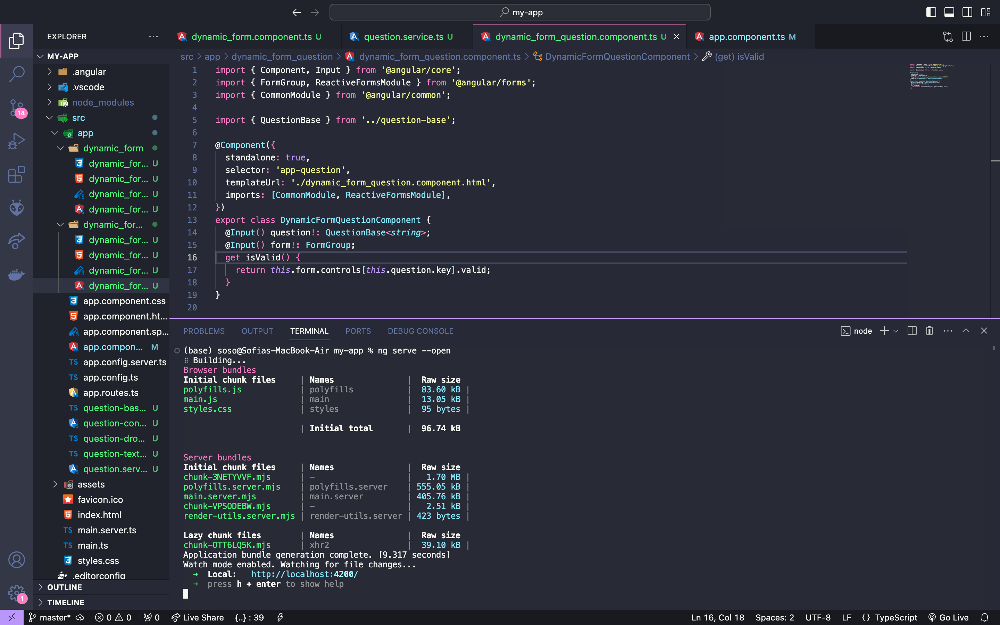

# ponderada-prog-s4

Single Page Application (SPA) é um tipo de aplicação web que carrega uma única página HTML e atualiza dinamicamente o conteúdo desta à medida que o usuário interage com apágina, sem a necessidade de recarregá-la. Isso é alcançado usando tecnologias como JavaScript para manipulação do DOM e frameworks como Angular, React ou Vue.js. SPAs proporcionam uma experiência mais rápida e fluida ao usuário, pois minimizam as transições entre páginas tradicionais. No caso dessa ponderada, foi utilizado o Angular, que permite o desenvolvimento por meio de componententes.

Ao realizar a ponderada, juntamente com outros autoestudos, pude entender melhor como uma SPA funciona, quais suas vantagens, mas também quais as suas desvantagens. Uma delas é que páginas únicas estão mais sucetíveis a ataques hackers, pois eles tem "tudo que precisam" em apenas um único lugar. Considerando isso, ao realizar um projeto, vale a pena discutir se a prioridade é velocidade ou segurança, para saber se é o caso de utilizar um SPA ou um MPA.

Abaixo é possível visualizar as imagens referentes ao meu código.

Como é possível perceber com essa imagem do terminal, a aplicação está rodando sem problemas no localhost

 

Como é possível perceber nessa segunda imagem, a aplicação está rodando, e foi possível enviar os meus dados de herói sem recarregar a página

 
